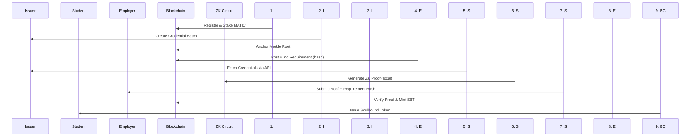

# 🚀 NexusCred — Zero-Knowledge Credential Verification System

A **blockchain-based credential verification system** that lets students prove eligibility for jobs using **zero-knowledge proofs** while revealing **zero personal data**.

## 🎯 What It Does

- **Multi-credential verification**: Combine credentials from 3+ institutions in **one cryptographic proof**
- **Complete privacy**: Prove GPA ≥ 3.0, certifications, experience without revealing actual values
- **Blockchain security**: All credentials anchored on-chain with fraud detection and slashing
- **Fast verification**: ~5 seconds proof generation, ~1ms verification
- **Non-transferable tokens**: ERC-5192 soulbound tokens as proof of eligibility

## 🏗️ Architecture

```
Smart Contracts (Solidity)  ←→  ZK Circuits (Circom)  ←→  Backend (FastAPI)  ←→  Frontend (Vite)
        ↓                           ↓                        ↓                   ↓
   On-chain verification      Privacy proofs           API endpoints        User dashboards
   Issuer staking/slashing   Groth16 proofs           VC issuance          Role-based UI
   Merkle root anchoring    Predicate checks          Batch management     Proof generation
```

---

## 📁 Repository Structure

```
contracts/          # Solidity smart contracts (Hardhat)
├── contracts/      # Main contract files
├── scripts/        # Deployment scripts
└── test/          # Contract tests

zk/                 # Zero-knowledge circuits
├── circuits/      # Circom circuit files
├── scripts/       # Proof generation/verification
└── utils/         # Merkle tree utilities

backend/            # FastAPI REST API
├── app/           # Main application code
├── requirements.txt # Python dependencies
└── test/          # API tests

frontend/           # Vite web application
├── src/           # TypeScript source files
├── public/        # Static assets
└── dist/          # Build output

docs/              # Architecture documentation
```

---

## 🚀 Quick Start (Blockchain Deployment)

### Prerequisites

- **Node.js** ≥ 18.0.0
- **Python** ≥ 3.8
- **Git**

### 1. Smart Contracts (Local Blockchain)

```bash
# Terminal 1: Start local blockchain
cd contracts
npm install
npm run node

# Terminal 2: Deploy contracts
cd contracts
npm run deploy:local
```

**Contracts deployed:**
- `IssuerRegistry` - Issuer registration and staking
- `IssuerVault` - Collateral management
- `CredentialAnchor` - Merkle root anchoring
- `RequirementCommit` - Blind job requirements
- `NexusVerifier` - ZK proof verification
- `VerifiedEligibilitySBT` - Soulbound tokens

### 2. Backend API Server

```bash
cd backend
pip install -r requirements.txt
python -m uvicorn app.main:app --reload --port 8000
```

**API available at:** http://localhost:8000/docs

### 3. Frontend Web Application

```bash
cd frontend
npm install
npm run dev
```

**Frontend available at:** http://localhost:5173

### 4. Zero-Knowledge Circuits

```bash
cd zk
npm install
# Compile circuits
npm run compile
# Setup proving keys
npm run setup
```

---

## 🔄 Complete Workflow (9 Steps)



**Step Details:**

1. **Issuer Registration**: Stake 1000+ MATIC, register on-chain
2. **Batch Creation**: Package ~100 student credentials (GPA, certs, dates)
3. **Blockchain Anchoring**: Post Merkle root on-chain, calculate fraud score
4. **Blind Requirements**: Employer posts only hash of job requirements
5. **Credential Fetch**: Student gets all issued VCs via API
6. **ZK Proof Generation**: Local Circom circuit proves predicates without revealing values
7. **Proof Submission**: Send proof + requirement hash to employer
8. **Verification**: Backend verifies proof matches requirement hash
9. **SBT Issuance**: Smart contract mints non-transferable eligibility token

---

## 12 Problems Solved

| Problem | Solution |
|---------|----------|
| Multi-source verification | Circom circuit bundles 3+ credentials in single proof |
| Privacy leak in hiring | Never reveal GPA/salary/history—only prove predicates |
| Employer fraud | Requirement hash prevents changing job description after proof submission |
| Issuer fraud | On-chain Merkle root and fraud score detection with slashing |
| Impersonation | Credentials anchored on-chain; Merkle proofs verify batch membership |
| Slow verification | Groth16: ~5ms on-chain, ~1ms off-chain; zero-knowledge prevents data leakage |
| Student lock-in | Credentials portable; proof generated locally (zero-knowledge) |
| Range proof complexity | Circom templates handle automated predicate constraints |
| Cost and gas limits | Single proof covers ALL predicates; gas-efficient verification |
| Access barriers | Simple web UI accessible; no wallet required (optional for on-chain steps) |
| Audit gaps | All events on-chain and immutable; chain of custody clear |
| Credential spoofing | Issuer reputation score and community appeals process |

---

## 📚 API Reference

### Issuer Endpoints

**POST** `/api/issuer/register`
```json
{
  "issuer_address": "0x1234...",
  "issuer_name": "MIT",
  "stake_amount": 1000
}
```

**POST** `/api/issuer/batch/create`
```json
{
  "issuer": "0x1234...",
  "credentials": [
    {
      "student_id": "alice123",
      "student_name": "Alice Chen",
      "gpa": 3.8,
      "cloud_certified": true,
      "years_experience": 3,
      "graduation_year": 2021
    }
  ]
}
```

**POST** `/api/batch/{batch_id}/anchor`
Returns: `{ "merkle_root": "0x...", "fraud_score": 0.02, "tx_hash": "0x..." }`

### Student Endpoints

**GET** `/api/student/{student_id}/credentials`
Returns all issued Verifiable Credentials

**POST** `/api/student/{student_id}/proof/generate`
```json
{
  "requirement_hash": "0x9a1b2c3d..."
}
```
Returns: `{ "proof": { "pi_a": [...], "pi_b": [...], "pi_c": [...] } }`

### Employer Endpoints

**POST** `/api/employer/requirement`
```json
{
  "employer": "Google",
  "description": "Software Engineer - Cloud Focus",
  "gpa_min": 3.0,
  "cloud_certified": true,
  "years_experience_min": 2,
  "grad_year_min": 2020
}
```

**POST** `/api/proof/verify`
```json
{
  "student_id": "alice123",
  "requirement_hash": "0x...",
  "proof_data": { "pi_a": [...], "pi_b": [...], "pi_c": [...] }
}
```
Returns: `{ "valid": true, "sbt_token_id": "12345" }`

---

## 🔧 Smart Contracts

| Contract | Purpose | Key Features |
|----------|---------|-------------|
| `IssuerRegistry` | Issuer registration & reputation | Staking, slashing, reputation tracking |
| `IssuerVault` | Collateral management | Secure MATIC storage, fraud penalties |
| `CredentialAnchor` | Merkle root anchoring | Batch verification, fraud scoring |
| `RequirementCommit` | Blind job requirements | Hash-only commitments, employer privacy |
| `NexusVerifier` | ZK proof verification | Groth16 verification, SBT triggering |
| `VerifiedEligibilitySBT` | Soulbound tokens | ERC-5192, non-transferable, proof of eligibility |

**Contract Addresses (Local):**
- IssuerRegistry: `0x5FbDB2315678afecb367f032d93F642f64180aa3`
- IssuerVault: `0xe7f1725E7734CE288F8367e1Bb143E90bb3F0512`
- CredentialAnchor: `0x9fE46736679d2D9a65F0992F2272dE9f3c7fa6e0`
- RequirementCommit: `0xCf7Ed3AccA5a467e9e704C703E8D87F634fB0Fc9`
- NexusVerifier: `0xDc64a140Aa3E981100a9becA4E68596DBFe5259f`
- VerifiedEligibilitySBT: `0x5FC8d32690cc91D4c39d9d3abcBD16989F875701`

---

## 🧮 Zero-Knowledge Circuits

### Main Circuit (`main.circom`)

**Private Inputs:**
- 3 credential Merkle proofs (one per issuer)
- 7 predicates (GPA, certifications, experience, etc.)

**Public Inputs:**
- 3 Merkle roots (from on-chain anchors)
- Requirement hash (employer commitment)

**Computation Steps:**
1. Verify Merkle proofs against on-chain roots
2. Check all predicates (range proofs, boolean checks)
3. Prove requirement hash matches commitment

**Output:**
- Single Groth16 proof (5 seconds generation, 1ms verification)

### Circuit Compilation

```bash
cd zk/circuits
circom main.circom --r1cs --wasm --sym --prime bn128
snarkjs groth16 setup main.r1cs powersoftau.ptau main.zkey
snarkjs zkey contribute main.zkey
```

**Circuit Constraints:** ~5,000 for full 3-credential, 7-predicate proof

---

## 🔐 Privacy & Security Guarantees

| Data Type | Revealed? | Protection Method |
|-----------|-----------|------------------|
| Exact GPA | ❌ No | Range proof (GPA ≥ 3.0) |
| Graduation Year | ❌ No | Predicate proof (graduated before 2024) |
| Certificate Name | ❌ No | Boolean proof (has cloud cert) |
| Work History | ❌ No | Range proof (2+ years experience) |
| Issuer Identity | ✅ Yes | Merkle root reference (required) |
| Student ID | ✅ Yes | Linked to proof (prevents duplicates) |
| Requirement Hash | ✅ Yes | Employer commitment (prevents changes) |

**Key Features:**
- **Zero-knowledge**: Mathematically proven privacy
- **Local computation**: Proofs generated on-device, no data leakage
- **Non-transferable**: SBTs prevent credential selling
- **Fraud detection**: On-chain slashing for malicious issuers

---

## 🛠️ Technology Stack

| Layer | Technology | Purpose |
|-------|------------|---------|
| **Blockchain** | Solidity + Hardhat | Smart contracts, on-chain verification |
| **Privacy** | Circom 2.0 + snarkjs | ZK proof generation (Groth16) |
| **Backend** | FastAPI + Python | REST API, VC management |
| **Frontend** | Vite + TypeScript | Role-based dashboards |
| **Cryptography** | SHA256 + Poseidon | Merkle trees, circuit commitments |
| **Storage** | In-memory (demo) | Replaceable with MongoDB/Postgres |

## 📱 User Roles

### 🏛️ Issuer (IIT, AWS, Infosys)
- Register with 1000+ MATIC stake
- Create credential batches (~100 students)
- Calculate Merkle roots and fraud scores
- Anchor credentials to blockchain
- Distribute Verifiable Credentials

### 🎓 Student
- View all issued credentials
- Find eligible job requirements
- Generate ZK proofs locally (5 seconds)
- Receive soulbound eligibility tokens

### 🏢 Employer
- Post blind job requirements (hash only)
- Review anonymous candidate proofs
- Verify eligibility without revealing data
- Hire qualified candidates

---

## Files Overview

| File | Lines | Purpose |
|------|-------|---------|
| backend/app/main.py | 400+ | Complete FastAPI backend with all endpoints |
| frontend/src/main.ts | 150+ | Role selector and workflow display |
| frontend/src/issuer.ts | 220+ | Issuer dashboard (batch creation, anchoring) |
| frontend/src/student.ts | 280+ | Student wallet (credential fetch, proof generation) |
| frontend/src/employer.ts | 260+ | Employer dashboard (requirement posting, verification) |
| frontend/src/api.ts | 150+ | API client wrapper functions |
| frontend/src/style.css | 600+ | Complete styling and animations |
| zk/circuits/main.circom | 180+ | Full cross-credential eligibility circuit |
| zk/circuits/simple.circom | 50+ | Simplified circuit for basic testing |
| zk/utils/merkle.js | 100+ | Merkle tree operations (build, verify, proof) |
| zk/scripts/generateProof.js | 80+ | Groth16 proof generation wrapper |
| zk/scripts/verifyProof.js | 60+ | Local proof verification before submission |

---

## 🚀 Deployment Guide

### Local Development

```bash
# Clone and setup
git clone <repository-url>
cd Nexes

# 1. Start blockchain (Terminal 1)
cd contracts && npm install && npm run node

# 2. Deploy contracts (Terminal 2)
cd contracts && npm run deploy:local

# 3. Start backend (Terminal 3)
cd backend && pip install -r requirements.txt && python -m uvicorn app.main:app --reload --port 8000

# 4. Start frontend (Terminal 4)
cd frontend && npm install && npm run dev

# 5. Setup ZK circuits (Terminal 5)
cd zk && npm install && npm run compile && npm run setup
```

### Production Deployment (Polygon/Sepolia)

1. **Update Hardhat Config**:
```typescript
// contracts/hardhat.config.ts
module.exports = {
  networks: {
    polygon: {
      url: "https://polygon-rpc.com",
      accounts: [process.env.PRIVATE_KEY],
    },
    sepolia: {
      url: "https://sepolia.infura.io/v3/YOUR_PROJECT_ID",
      accounts: [process.env.PRIVATE_KEY],
    }
  }
};
```

2. **Deploy Contracts**:
```bash
npm run deploy:polygon  # or npm run deploy:sepolia
```

3. **Update Environment Variables**:
```bash
# backend/.env
RPC_URL=https://polygon-rpc.com
PRIVATE_KEY=your_private_key
CONTRACT_ADDRESSES={...}

# frontend/.env
VITE_API_BASE_URL=https://your-api-domain.com
VITE_CONTRACT_ADDRESSES={...}
```

## 🔧 Troubleshooting

### Common Issues

**Issue**: "Compilation failed - virtual function error"
**Solution**: Ensure `virtual` keyword is used when overriding OpenZeppelin functions

**Issue**: "ZK circuit compilation failed"
**Solution**: Install circom compiler: `npm install -g circom`

**Issue**: "API connection refused"
**Solution**: Check backend is running on port 8000 and CORS is configured

**Issue**: "Contract not deployed"
**Solution**: Ensure local blockchain is running and contracts are deployed to correct network

### Gas Costs

- **Issuer Registration**: ~50,000 gas (staking)
- **Batch Anchoring**: ~80,000 gas (Merkle root storage)
- **Proof Verification**: ~30,000 gas (ZK verification)
- **SBT Minting**: ~40,000 gas (soulbound token)

---

## 🎯 Example Walkthrough

### Scenario: MIT Student Applying to Google

#### 1. MIT (Issuer) Setup
```bash
# MIT registers as issuer
curl -X POST http://localhost:8000/api/issuer/register \
  -H "Content-Type: application/json" \
  -d '{
    "issuer_address": "0x1234...",
    "issuer_name": "MIT",
    "stake_amount": 1000
  }'

# MIT creates credential batch
curl -X POST http://localhost:8000/api/issuer/batch/create \
  -H "Content-Type: application/json" \
  -d '{
    "issuer": "0x1234...",
    "credentials": [
      {
        "student_id": "alice123",
        "student_name": "Alice Chen",
        "gpa": 3.8,
        "cloud_certified": true,
        "years_experience": 3,
        "graduation_year": 2021
      }
    ]
  }'
```

#### 2. Google (Employer) Posts Job
```bash
curl -X POST http://localhost:8000/api/employer/requirement \
  -H "Content-Type: application/json" \
  -d '{
    "employer": "Google",
    "description": "Senior Cloud Engineer",
    "gpa_min": 3.5,
    "cloud_certified": true,
    "years_experience_min": 2,
    "grad_year_min": 2020
  }'
# Returns: { "requirement_hash": "0x9a1b2c3d..." }
```

#### 3. Alice (Student) Applies
```bash
# Alice fetches her credentials
curl http://localhost:8000/api/student/alice123/credentials

# Alice generates ZK proof
curl -X POST http://localhost:8000/api/student/alice123/proof/generate \
  -H "Content-Type: application/json" \
  -d '{ "requirement_hash": "0x9a1b2c3d..." }'
# Returns: { "proof": { "pi_a": [...], "pi_b": [...], "pi_c": [...] } }
```

#### 4. Google Verifies and Hires
```bash
curl -X POST http://localhost:8000/api/proof/verify \
  -H "Content-Type: application/json" \
  -d '{
    "student_id": "alice123",
    "requirement_hash": "0x9a1b2c3d...",
    "proof_data": { "pi_a": [...], "pi_b": [...], "pi_c": [...] }
  }'
# Returns: { "valid": true, "sbt_token_id": "12345" }
```

**Result**: Alice receives SBT #12345 proving eligibility without revealing her exact GPA or personal details.

---

## 🤝 Contributing

### Development Setup

1. **Fork and clone** the repository
2. **Create feature branch**: `git checkout -b feature/amazing-feature`
3. **Install dependencies**: Run the quick start commands
4. **Make changes** and test thoroughly
5. **Submit pull request** with detailed description

### Code Standards

- **Solidity**: Follow OpenZeppelin style guide
- **TypeScript**: Use strict mode, proper typing
- **Python**: Follow PEP 8, use type hints
- **Circom**: Use clear signal naming, add comments

### Testing

```bash
# Run all tests
npm run test

# Specific component tests
npm run test:contracts
npm run test:backend
npm run test:circuits
```

## 📄 License

MIT License - see [LICENSE](LICENSE) file for details.

## 🙏 Acknowledgments

- **Circom** - ZK circuit framework
- **snarkjs** - Groth16 proof generation
- **OpenZeppelin** - Secure smart contracts
- **FastAPI** - Modern Python API framework
- **Vite** - Fast frontend build tool

---

## 📞 Support

- **Documentation**: Check `docs/` folder for detailed architecture
- **Issues**: Open GitHub issue for bugs or feature requests
- **Discussions**: Use GitHub Discussions for questions
- **Email**: support@nexuscred.example.com

---

**🚀 NexusCred - Privacy-preserving credential verification for the future of work**

*Built with ❤️ for students, issuers, and employers worldwide*
